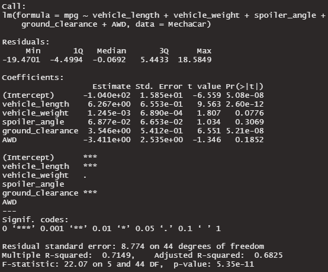
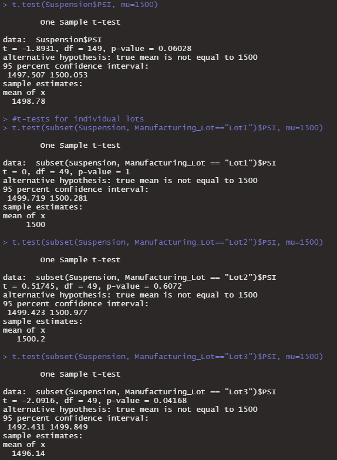

# MechaCar_Statistical_Analysis

## Linear Regression to Predict MPG

The most significant variables in our dataset which show a non-random effect on the MPG of the MechaCar are the Vehicle Length and the Ground Clearance. The vehicle length with a p-value of 2.60e-12 and the ground clearance with a p-value of 5.21e-8. 

The slope of the linear model is not zero.  We can see that the slope coefficients contain significant non-zero values (vehicle length, ground clearance, and AWD), and the p-values are less than the significance level of p=0.05. so we can Reject our null hypothesis. 

Our r^2 value is 0.7149, which means the model does have good predictive power for the mpg.

## Summary Statistics on Suspension Coils

In the total summary, we can see the variance of all three lots in tandem does fall under the maximum variance of 100 PSI with a variance of 62 PSI.

In the lot summary, we see that the major contributor to the variance is lot 3 with a variance of 170 PSI with the other two lots having variances below 8 PSI.

In total, the manufacturing data meets the maximum variance in PSI requirement, but we can see that there are clearly big problems in lot 3 with a variance of 170 PSI.  Lot 3 does not meet the maximum variance requirement.

## T-Tests on Suspension Coils

From our first t-test, we can see the sample mean is not statistically different from the population mean of 1500 PSI with a p-value of 0.06.

However, when we perform t-tests on the individual lots, we can see that although lots 1 and 2 are not statistically different from the population mean with p-values of 1 and 0.6 respectively, lot 3 does have a mean which is statistically different from the population mean with a p-value of 0.04.

## Study Design: MechaCar vs Competition

In order to compare the performance of the MechaCar against the competition, we need to address a few observables which would be of interest to our customers.  These variables will be cost, city and highway fuel efficiency, horsepower, safety rating, and carbon waste output.

We will be testing whether or not the MechaCar has statistically significant differences in these metrics compared to competing models.  The null hypothesis will be that these observables don't vary significantly from the competition, and the alternative hypothesis will be that the MechaCar does indeed vary significantly in these variables compared to the competition.  

We will perform one-tailed t-tests in order to determine if the MechaCar has higher or lower observed values in these variables than the competition according to which direction the consumer would prefer.  The consumer would want the cost to be lower, the city and highway fuel efficiency to be higher, the horsepower to be higher, the safety rating to be higher, and the carbon waste output to be lower.

In order to run these statistical tests, we would need the cost, fuel efficiency, horsepower, safety rating, and carbon waste output data from the MechaCar as well as the MechaCar's competitors.
